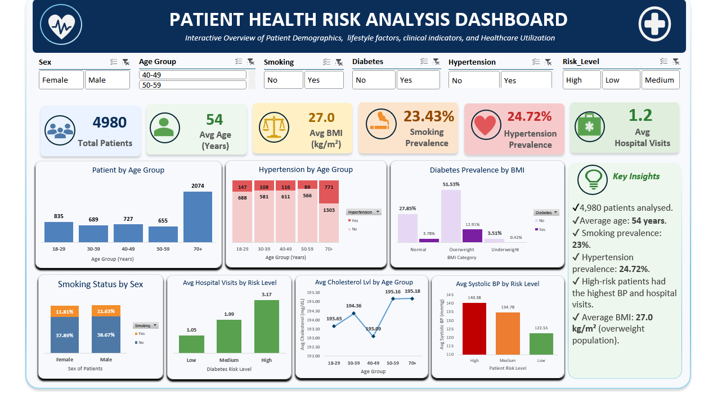

# Patient Health Risk Analysis Dashboard

> **Portfolio Stage 1 — Analytics Foundations | Healthcare Analytics | Microsoft Excel**

This project marks the foundation stage of my transition into data analytics. Drawing on my healthcare background, I used Microsoft Excel to explore a synthetic patient dataset, identify patterns in health risk indicators, and present the results through an interactive dashboard.



## Project Overview

The analysis focuses on patient demographics, lifestyle behaviours, clinical indicators and healthcare utilisation. The goal was to practise an end-to-end analytical workflow: preparing data, exploring patterns, developing useful KPIs and communicating findings visually.

| Dataset | Records | Variables |
|---|---:|---:|
| Synthetic healthcare dataset | **4,980** | **18** |

## Questions Explored

- What does the patient population look like by age and key health indicators?
- How common are smoking and hypertension within the dataset?
- What patterns appear among patients classified as higher risk?
- How do indicators such as BMI, blood pressure and hospital visits differ across the population?
- How can the findings be communicated clearly in an interactive Excel dashboard?

## Key Findings

- The dataset contains **4,980 patient records**.
- Average patient age was approximately **54 years**.
- Smoking prevalence was approximately **23%**.
- Hypertension prevalence was approximately **25%**.
- Higher-risk patients showed higher blood pressure and more hospital visits.
- Average BMI indicated an overall overweight population.

## What I Did

- Prepared and validated the healthcare dataset for analysis.
- Performed exploratory analysis of demographic, lifestyle and clinical variables.
- Built PivotTables to summarise key measures.
- Created KPI cards and PivotCharts.
- Added slicers for interactive exploration.
- Designed a dashboard to bring the main findings together in one view.

## Skills Demonstrated

- Microsoft Excel
- Data cleaning and validation
- Exploratory data analysis
- PivotTables and PivotCharts
- KPI development
- Interactive slicers
- Healthcare analytics
- Dashboard design
- Data visualisation
- Insight communication

## Repository Structure

```text
Healthcare-Patient-Risk-Analysis-Dashboard/
├── Dashboard/
│   └── Excel dashboard workbooks
├── Data/
│   └── Cleaned healthcare dataset
├── Image/
│   └── Dashboard.png
└── README.md
```

## Portfolio Journey

**Stage 1 — Analytics Foundations:** this project  
→ **[Stage 2 — Coffee Sales Analysis](https://github.com/RxAnalyst-Aisosa/Coffee-Sales-Analysis-Excel-Portfolio-Project)**  
→ **[Stage 3 — Excel Sales Analysis Dashboard](https://github.com/RxAnalyst-Aisosa/Excel-Sales-Analysis-Dashboard)**

## Portfolio Progression

This was my first complete analytics portfolio project. It helped me move from learning individual Excel features to completing a full analysis from dataset preparation through to dashboard presentation.

My later projects build on this foundation by introducing more structured multi-table analysis, stronger business-question framing, more advanced Excel functions and increasingly professional project documentation.

## Why This Project Matters

My background is in pharmacy and healthcare, so this project gave me an opportunity to connect domain knowledge with analytical thinking. It also strengthened my ability to move beyond simply producing charts and instead focus on the questions the analysis is intended to answer.

---

**Aisosa Elizabeth Erhunmwunsee**  
*Pharmacy | Business Analytics | Data Analysis | Healthcare Analytics*
